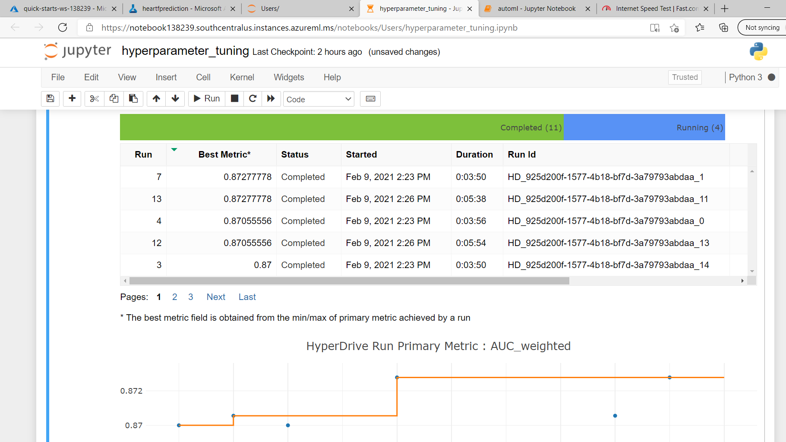

# :dizzy: AZURE MACHINE LEARNING ENGINNER :dizzy: 

This project gives us the opportunity to use the knowledge that we have obtained from the Nanodegree program to solve an interesting problem.In this project, we will create a two models :- one using AutomatedML(AutoML) and one customized model whose hyperparameters are tuned using HyperDrive.Then, compare the performance of the both models and deploy the best performing model.This project will demonstarte our ability to use an external dataset (I am using heart_failure_prediction dataset from kaggle to build a classification model)in our workspace train a model using the different tools available in the AzureML framework as well as will get to know the ability to deploy the model as a webservice.  


# :dizzy: Dataset

## :dizzy: Overview

In this project, I used the "Heart Failure Prediction" dataset from Kaggle **[dataset](https://www.kaggle.com/andrewmvd/heart-failure-clinical-data)**. The dataset contains 12 clinical features of 299 patients.Here "DEATH EVENT" is the target variable, we need to predict the possible death event occured due to heat failure of the patients.With the help of HyperDrive and AutoML will get to know the death rates of the patients.

## :dizzy: Task

The task of this project is to predict the "DEATH_EVENT" of the patients.This problem belongs to classification category.The target variable death event is in the boolean form, with the help of two models will predict the survival rate of the patients due to heart failure.

**12 clinical features are** :- age, anaemia, creatinine_phosphokinare, diabetes, ejection_fraction, high_blood_pressure, platelets, serum_creatinine, serum_sodium, sex, smoking, time.

**Target variable** :- death_event


| Features                    | Description                                              |
| ----------------------------| ---------------------------------------------------------|
| Age                         | 1 for Male 0 for Female
|anaemia                      | a condition in which there is a deficiency of red cells or of haemoglobin in the blood, resulting in tired, weakness, shortness of breath, and a                                poor ability to exercise.
|creatinine_phosphokinase     | (mcg/L):(CPK) or (CK) is a enzyme that catalyzes the reaction of creatine and adenosine triphosphate (ATP),Phosphocreatine created from this                                    reaction is used to supply tissues and cells e.g. brain skeletal muscles, and the heart.
|diabetes                     |  a metabolic disease that causes high blood sugar. Result in increased hunger, increased thirst,weight loss,frequent urination,blurry                                             vision,extreme fatigue,sores that don’t heal
|ejection_fraction            | Percentage of blood leaving the heart at each contraction (percentage)
|high_blood_pressure          | common condition in which the long-term force of the blood against your artery
|platelets                    | (kiloplatelets/mL): small, colorless cell fragments in our blood that form clots and stop or prevent bleeding.
|serum_creatinine             | (mg/dL): Level of serum creatinine in the blood
|serum_sodium                 | (mEq/L): Level of serum sodium in the blood. Reference range for serum sodium is 135-147 mmol/L
|sex                          | Woman or man (binary)
|smoking                      | If the patient smokes or not (Boolean)
|time                         | Follow-up period (days)


|Target Variable | Description                                                      |
|----------------|------------------------------------------------------------------|
| DEATH_EVENT    | whether the patient survived or not due to heart failure (Boolean)|


## :dizzy: Access

In AutoML part, I have registered the dataset in the azure workspace.


In Hyperdrive part, I saved the dataset to my GitHub repository and retrieved the data from a URL using TabularDatasetFactory class in train.py script.


# :dizzy: Automated ML

|Parameters                     |Value                          |
|------------------------------ |-------------------------------| 
|experiment_timeout_minutes     |20                             |
|max_concurrent_iterations      |5                              |
|primary_metric | AUC_weighted|
|task  | Classification|
|compute_target | "General_cluster" previously created|
|training_data | dataset registered in Azure Workspace|
|label_column_name | DEATH_EVENT|
|enable_early_stopping | True|
|featurization | auto|
|debug_log | automl_errors.log|

### :dizzy: Description

**automl settings** :- experiment_timeout_minutes - maximum amount of time the experiment can take. So, I set it to 20 minutes to save time. 
max_concurrent_iterations - maximum number of parallel runs executed on a Automl Compute cluster. As it should be less than or equal to the number of nodes (5) so its set when creating the compute cluster(it is set to 5). The primary metric is Under the Curve Weighted, **AUC_weighted**, to deal with class imbalance as The AUC is an estimate of the probability that a classifier will rank a randomly chosen positive instance higher than a randomly chosen negative instance. For this reason, the AUC is widely thought to be a better measure than a classification error rate based upon a single prior probability or KS statistic threshold.

**AutoMLConfig** :-  This is a binary classification task. Heart Failure "dataset" is imported earlier from the registered dataset in Azure Workspace. The target variable which we need to peredict in this experiment is "DEATH_EVENT". To save time and resources, the enable_early_stopping parameter is set to True.


### :dizzy: Results

**Results of AutoML** :- The experiment showed that VotingEnsemble is the best performing model with a score = 0.9218579454785403. 

The parameters of the pre-fitted by the model is shown below


### :dizzy: Parameters of the fitted model

```

Fitted model and its hyperparameters :  ('prefittedsoftvotingclassifier', PreFittedSoftVotingClassifier(classification_labels=None,
                              estimators=[('39',
                                           Pipeline(memory=None,
                                                    steps=[('standardscalerwrapper',
                                                            <azureml.automl.runtime.shared.model_wrappers.StandardScalerWrapper object at 0x7f80d9a61630>),
                                                           ('randomforestclassifier',
                                                            RandomForestClassifier(bootstrap=True,
                                                                                   ccp_alpha=0.0,
                                                                                   class_weight=None,
                                                                                   criterion='gini',
                                                                                   max_depth=None,
                                                                                   ma...
                                                                                 min_weight_fraction_leaf=0.0,
                                                                                 n_estimators=10,
                                                                                 n_jobs=1,
                                                                                 oob_score=True,
                                                                                 random_state=None,
                                                                                 verbose=0,
                                                                                 warm_start=False))],
                                                    verbose=False))],
                              flatten_transform=None,
                              weights=[0.06666666666666667, 0.06666666666666667,
                                       0.06666666666666667, 0.06666666666666667,
                                       0.13333333333333333, 0.06666666666666667,
                                       0.06666666666666667, 0.13333333333333333,
                                       0.06666666666666667, 0.06666666666666667,
                                       0.2]))
                                       
 
 ```
 
 ### :dizzy: Improvement 
 
To improve model results, we can use k-fold cross validation, we can increase time of the experiment so that we can come up with good algorithms which can be imporved the model further. We can also perform feature selection and engineering and also we can explore different matrics like accuracy, F1-score .
 

 ### :dizzy: SCREENSHOTS AND RUN WIDGETS

The below screenshot describes the status of the AutoML, still its configuring the best model for the dataset used above.


On 58th run of the AutoML its predicted that VotingEnsemble is the best performing model among the other algorithms.


The below widget shows the AUC_weighted matrix visualization for the dataset.


Below two screenshots describe the various algorithms performed by AutoML .


# :dizzy: Hyperparameter Tuning

### :dizzy: Description

I have choosen Logistic Regression because it is a binary classification algorithm in which dependent variable is binary i,e 1(True,Sucess),0(False,Failure). Goal is to find the best fitting model for independent and dependent variable in the relationship. Independent variable can be continous or binary, also called as logit regression, used in machine learning,deals with probability to measure the relation between dependent and independent variables.


RandomParameter Sampling is used to randomly select a value for each hyperparameter, which can be a mix of discrete and continuous values.Here in code we need to search for parameter like "_C" and " _max_iter

```
param_sampling = RandomParameterSampling( 
    {
    '--C': choice(0.0001, 0.001, 0.01, 0.1, 1,10,100,1000),
    '--max_iter': choice(100, 200, 300, 400, 500)
    }
)

  ```
  
The model was trained using different combinations of C and max_iter hyperparameters. C is inverse of regularization strength as support vector machines and smaller values    specify stronger regularization. The maximum total number of runs to craete and the maximum numbers of runs to execute concurrently.(Note :- If none, all runs are launched in parallel.The number of concurrent runs is gated on the resources available in the specified compute target. )Need to ensure that the compute target has the available resources for the desired concurrency.


### :dizzy: Results

In the HyperDrive experiment, the best model prediction score is 0.8727777777777778 

Below are the following parameter listed by hyperdrive 


                   

### :dizzy: Improvements

I Would like to test with different estimators.We can do feature engineering,drop unnecessary column and also would like to wait for more run by hyperdrive.

### :dizzy: SCREENSHOTS AND RUN WIDGETS




# :dizzy: Model Deployment

I have deployed best model using automl for my dataset, VotingEnsamble has showm up best model for the Heart_Failure_Prediction dataset.While executing automl downloaded 
the score.py script and env.yml by using ``` automl_best_run.download_file() ``` and deployed best model using azure container instance(ACI) i,e ``` aci_config = AciWebservice.deploy_configuration(cpu_cores=1, memory_gb=1) ``` Finally,the model was deployed as a webservice and we also got a logs by ```webservice.get_logs()``` Model status was Healthy.


To query the endpoint, created a sample input i,e the clinical features of the first three patients in the dataset and converted it to JSON, sent an HTTP POST request to the endpoint.

```

scoring_uri = "http://2916d686-189a-43c4-9622-777c8f480910.southcentralus.azurecontainer.io/score"

df = df.drop(columns=["DEATH_EVENT"])

input_data = json.dumps({
    'data': df[0:4].to_dict(orient='records')
})


print(input_data)

```


# :dizzy: Screen Recording

## https://youtu.be/F4xCr1v7HrY ##

# :dizzy: Standout Suggestions

*  **Convert model to ONNX format** :- The open neural network exchange(OONX) is an open source artifical intelligence ecosystem.It allows users to interchange models with various ML frameworks and tools.ONNX is a portability platform for models that was created by Microsoft and that allows you to convert models from one framework to another, or even to deploy models to a device (such as an iOS or Android mobile device).
[ONNX_DOCS](https://docs.microsoft.com/en-us/azure/machine-learning/how-to-deploy-existing-model)
[OONX](https://onnx.ai/)

* We can try deploying the best model with azure kubernetes service.

* We can choose another sklearn classifier rather then logestic regression.We can apply XGBoost or some Bagging and Boosting algorithms.

* We can choose another sampling policy rather then random sampler, we can choose grid search for betterment.
# :dizzy: References

:collision: [Hyperparameter_tuning_for_ml_models](https://github.com/microsoft/MLHyperparameterTuning)

:collision: [Deploy_and_consume_model](https://docs.microsoft.com/en-us/azure/machine-learning/how-to-consume-web-service?view=azure-ml-py&tabs=python#call-the-service-python)

:collision: [HyperDrive_Overview](https://docs.microsoft.com/en-us/azure/machine-learning/how-to-consume-web-service?view=azure-ml-py&tabs=python#call-the-service-python) 

:collision: [AutoML_Overview](https://docs.microsoft.com/en-us/azure/machine-learning/concept-automated-ml?view=azure-ml-py)

:collision: [Azure_ML_Notebboks](https://github.com/Azure/MachineLearningNotebooks)


  ****
